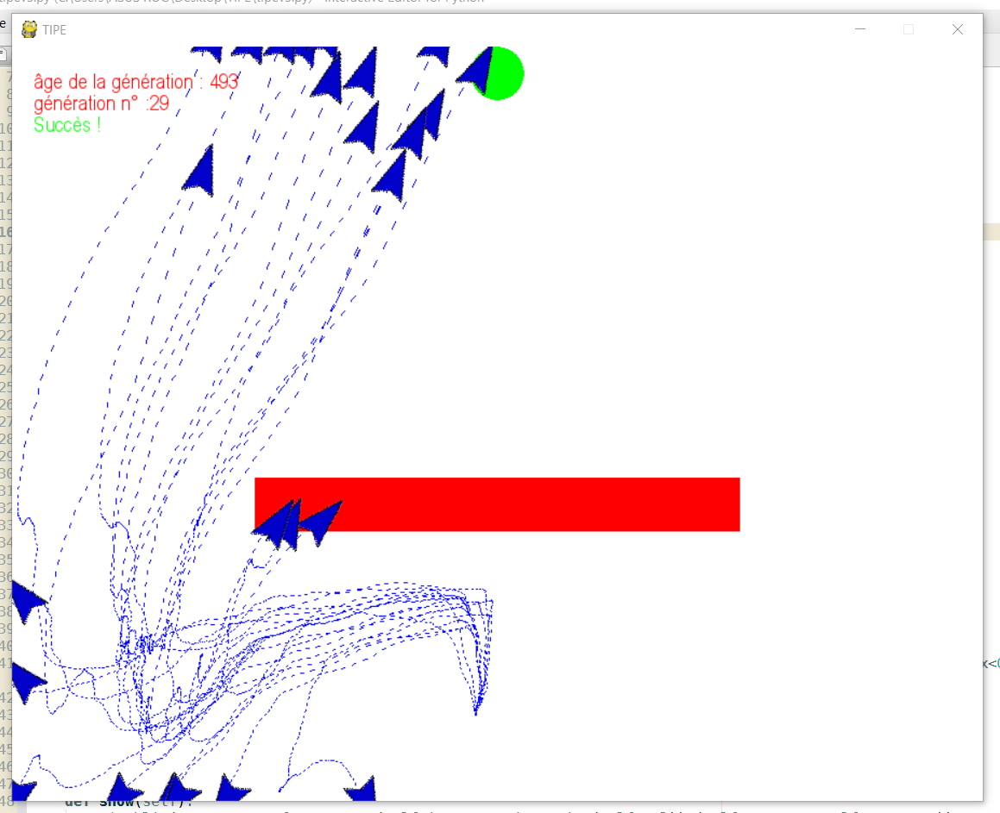

# Smart-rockets

A simple genetic algorithm demo where a population of moving objects try to reach a target, part of a math/computer science personal project done during the second year of my preparatory classes (Classes préparatoires, 2018). Coding was done entirely in Python, Pygame is used for visualization.

